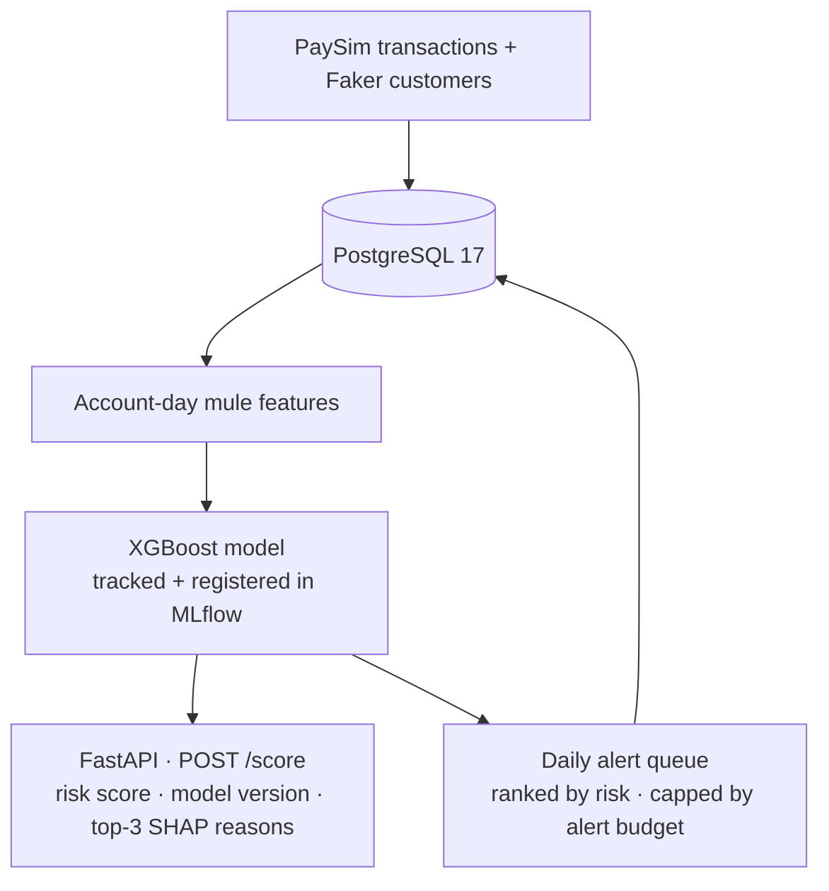

# MuleWatch

**AI investigation copilot for money-mule alerts.**


Instead of only asking whether an individual transaction is risky, MuleWatch starts from a **flagged account** and builds the evidence an analyst needs to investigate it. It scores accounts, explains every score, and produces a daily alert queue sized to analyst capacity.

MuleWatch is designed to **support** a financial-crime analyst. It recommends and explains; it never takes action on an account by itself.

> ⚠️ **Synthetic data only.** MuleWatch uses the public PaySim synthetic transaction dataset and Faker-generated customer profiles. No real customer data is used.

---

## Features

- **Account-level mule features** computed per account per day: pass-through ratio, dwell time, fan-in / fan-out, transfer-to-cash-out chains, velocity
- **XGBoost risk model**: class-weighted, trained on a time-based split, evaluated with PR-AUC
- **Model versioning with MLflow**: every score carries the version of the model that produced it
- **Explainable scoring API**: `POST /score` returns a risk score, the model version and the top three SHAP reasons
- **Daily alert queue**: accounts ranked by risk and capped by an operational analyst alert budget instead of a fixed 0.5 threshold
- **Idempotent alerts**: re-running alert generation never creates duplicates
- **Least-privilege database access**: the API connects through a read-only PostgreSQL role
- **CI**: GitHub Actions runs Ruff and pytest against a real PostgreSQL 17 service

---

## Architecture



---

## Money-mule features

| Feature | What it measures | Why it can signal mule activity |
|---|---|---|
| `pass_through_ratio` | Money out ÷ money in for the day | Mules forward almost everything they receive (≈ 1.0) |
| `median_dwell_minutes` | Median time from an inbound payment to the next outbound one | Mules move money on within minutes |
| `fan_in` / `fan_out` | Distinct senders / distinct receivers | Many unrelated senders paying into one account |
| `transfer_cashout_chains` | Received TRANSFER followed by a sent CASH_OUT | A classic laundering path |
| `velocity_ratio` | Today's transaction count ÷ historical daily average | Sudden activity spikes on a quiet account |

More detail: [`docs/FEATURES.md`](docs/FEATURES.md)

---

## Model

| | |
|---|---|
| Algorithm | XGBoost (`max_depth=3`, `n_estimators=200`, `scale_pos_weight` = negatives ÷ positives) |
| Validation | Time-based split: earliest 80% of dates for training, latest 20% for testing |
| Metric | PR-AUC (average precision), because mule accounts are rare and accuracy is misleading |
| Test PR-AUC | 0.XX |
| Tracking | MLflow experiment `mulewatch-account-scoring` with a registered model |

---

## Daily alerts

Each day, active accounts are scored and ranked, and the top accounts are selected up to the configured analyst alert budget. The effective threshold is the score of the lowest-ranked account that fits in the budget, so the queue matches what analysts can actually review.

Each alert stores the account ID, alert date, risk score, model version, SHAP reasons and status (`NEW`). A uniqueness constraint on `(account_id, alert_date)` with conflict-safe inserts makes alert generation idempotent.

---

## Getting started

### Prerequisites

- Python 3.14+
- Docker with Docker Compose
- The PaySim dataset from Kaggle ([Synthetic Financial Datasets For Fraud Detection](https://www.kaggle.com/datasets/ealaxi/paysim1)), saved as:
  ```text
  data/raw/PS_20174392719_1491204439457_log.csv
  ```

### 1. Install

```bash
python -m venv .venv
source .venv/bin/activate          # Windows: .venv\Scripts\Activate.ps1
pip install -e .
```

### 2. Start PostgreSQL and apply the schema

```bash
docker compose up -d postgres
docker compose exec -T postgres psql -U mulewatch -d mulewatch < db/schema.sql
docker compose exec -T postgres psql -U mulewatch -d mulewatch < db/roles.sql
```

<details>
<summary>Windows (PowerShell)</summary>

```powershell
docker compose up -d postgres
Get-Content db\schema.sql | docker compose exec -T postgres psql -U mulewatch -d mulewatch
Get-Content db\roles.sql  | docker compose exec -T postgres psql -U mulewatch -d mulewatch
```
</details>

### 3. Seed the database and train the model

```bash
python pipeline/seed.py      # samples 200,000 PaySim transactions + generates customers
python scoring/train.py      # trains XGBoost, logs and registers the model in MLflow
```

### 4. Start the API

```bash
docker compose up -d --build
```

The API runs at http://127.0.0.1:8000 and the interactive docs are at http://127.0.0.1:8000/docs.

---

## Usage

### Score an account

```bash
curl -X POST http://127.0.0.1:8000/score \
  -H "Content-Type: application/json" \
  -d '{"account_id": "C1436118706"}'
```

<details>
<summary>Windows (PowerShell)</summary>

```powershell
$body = @{ account_id = "C1436118706" } | ConvertTo-Json
Invoke-RestMethod -Method Post -Uri "http://127.0.0.1:8000/score" `
  -ContentType "application/json" -Body $body
```
</details>

**Response fields**

| Field | Description |
|---|---|
| `risk_score` | Model probability that the account shows mule-like behaviour |
| `model_version` | Registered MLflow model version that produced the score |
| `reasons` | Top three SHAP contributions (feature, value, impact) |

SHAP reasons explain how the model reached a score. They are not proof that an account is a money mule.

---

## Testing

```bash
ruff check .
pytest -q
```

The same checks run in GitHub Actions on every push and pull request, against a PostgreSQL 17 service container.

---

## Project structure

```text
mulewatch/
├── db/                  # schema.sql, roles.sql (read-only role)
├── pipeline/            # data seeding, feature engineering, alert generation
├── scoring/             # model training and FastAPI scoring service
├── docs/                # design document and feature definitions
├── tests/               # pytest suite
├── .github/workflows/   # CI: Ruff + pytest
├── docker-compose.yml
└── pyproject.toml
```

---

## Limitations

- **Synthetic data.** PaySim is transaction-centric: many accounts appear only a few times, which limits how much account-level behaviour the model can observe.
- **Proxy labels.** An account is labelled as a mule if it sent or received a PaySim transaction flagged as fraud. This approximates mule activity; it is not real-world ground truth.
- **Not for production use.** Scores and alerts are for learning and demonstration. Any real decision on an account requires human review.