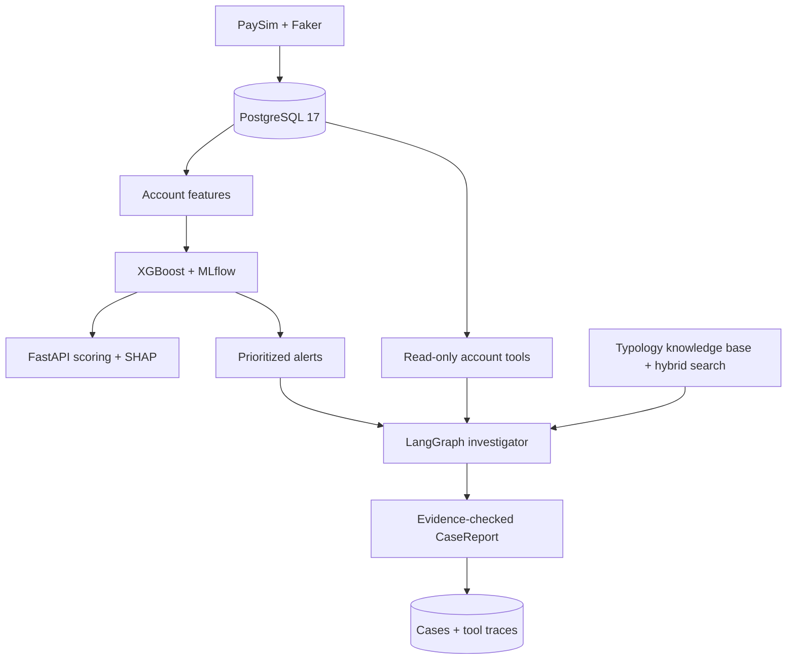
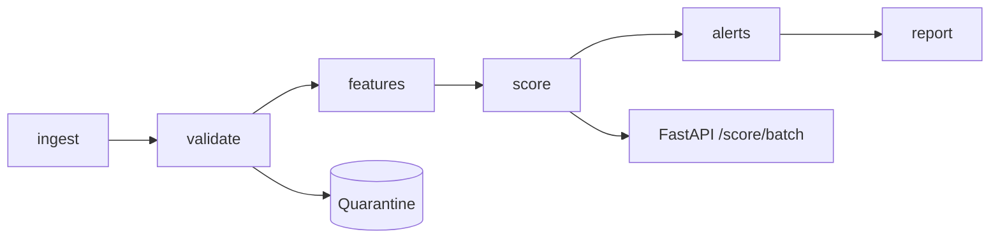
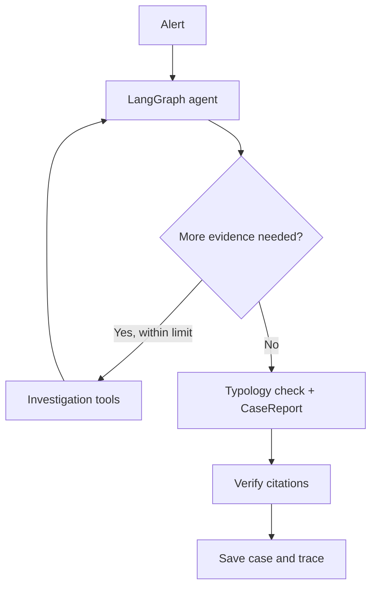

# MuleWatch

**AI investigation copilot for money-mule alerts.**


MuleWatch scores suspicious accounts, prioritizes alerts, and generates evidence-backed investigation reports for human analysts. It never takes action on accounts autonomously.

> ⚠️ **Synthetic data only.** Uses PaySim transactions and Faker-generated customer profiles.

---

## Features

- **Account behavior:** pass-through ratio, dwell time, fan-in/out, cash-out chains, velocity.
- **Risk scoring:** XGBoost, MLflow versioning, SHAP explanations, and `POST /score`.
- **Alert prioritization:** analyst-capacity-based queue with idempotent generation.
- **AI investigations:** LangGraph agent with bounded, read-only tools and hybrid typology retrieval (pgvector + full-text search).
- **Auditable reports:** structured findings, verified evidence references, PostgreSQL case and tool-trace storage.
- **Quality checks:** fake-LLM tests, resumable evaluation runner, Ruff and pytest CI.

---

## Architecture



---

## Daily Airflow pipeline

The `mulewatch_daily` DAG processes each logical date with PostgreSQL-backed intermediate results.



### Start Airflow

```powershell
docker compose -f airflow\docker-compose.yaml up -d
```

Airflow UI: `http://localhost:8080`.

### 30-day backfill

```powershell
docker compose -f airflow\docker-compose.yaml exec airflow-scheduler `
    airflow backfill create `
    --dag-id mulewatch_daily `
    --from-date 2026-01-01 `
    --to-date 2026-01-30 `
    --max-active-runs 1 `
    --reprocess-behavior none
```

### Airflow Grid


### Backfill summary

| Metric | Result |
|---|---|
| Date range | 2026-01-01 to 2026-01-30 |
| Completed days / volume metrics | Pending verification |

---

## Money-mule features

| Feature | Signal |
|---|---|
| `pass_through_ratio` | Outgoing ÷ incoming funds |
| `median_dwell_minutes` | Delay between incoming and outgoing payments |
| `fan_in` / `fan_out` | Unique senders and recipients |
| `transfer_cashout_chains` | Transfer followed by cash-out |
| `velocity_ratio` | Activity relative to historical baseline |

See [`docs/FEATURES.md`](docs/FEATURES.md).

---

## Model

| | |
|---|---|
| Algorithm | XGBoost; class-weighted |
| Validation | Time-based 80/20 split |
| Metric | PR-AUC |
| Test PR-AUC | Not verified here |
| Tracking | MLflow (`mulewatch-account-scoring`) |

---

## Daily alerts

Accounts are ranked by risk and selected up to the analyst alert budget. Each alert retains its account, date, score, model version, SHAP reasons and status. A unique `(account_id, alert_date)` constraint prevents duplicates.

---

## Evidence-backed investigations



### Investigation tools

| Tool | Purpose |
|---|---|
| `get_account_activity` | Account transaction summary |
| `score_account` | Risk score and explanations |
| `search_typologies` | Relevant guidance and citations |

Tool inputs are typed, database queries are parameterized, and investigations have a step limit.

### Case reports

`CaseReport` includes a risk rating, recommended analyst action, findings with evidence IDs, typology matches, open questions and confidence. Citation verification checks references, **not** whether every claim is factually correct. Reports and tool traces are stored in PostgreSQL.

### Evaluation and review

```powershell
python -m evals.run_alert                 # Dry run; no model calls
python -m evals.run_alert --max-new 1     # One new investigation
```

Results: `evals/results/alert_results.csv` and `.json`; manual findings: [`docs/FAILURES.md`](docs/FAILURES.md). Two live cases were completed in the recorded checkpoint; broader evaluation and manual review were still pending.

---

## Getting started

### Prerequisites

- Python 3.14+, Docker Compose.
- [PaySim dataset](https://www.kaggle.com/datasets/ealaxi/paysim1) at `data/raw/PS_20174392719_1491204439457_log.csv`.

### 1. Install

```powershell
python -m venv .venv
.\.venv\Scripts\Activate.ps1
pip install -e .
```

### 2. Start PostgreSQL and apply the schema

```powershell
docker compose up -d postgres
Get-Content db\schema.sql | docker compose exec -T postgres psql -U mulewatch -d mulewatch
Get-Content db\roles.sql | docker compose exec -T postgres psql -U mulewatch -d mulewatch
```

### 3. Seed the database and train the model

```powershell
python pipeline/seed.py
python scoring/train.py
```

### 4. Start the API

```powershell
docker compose up -d --build
```

API docs: `http://127.0.0.1:8000/docs`.

---

## Usage

### Score an account

```powershell
$body = @{ account_id = "C1436118706" } | ConvertTo-Json
Invoke-RestMethod -Method Post -Uri "http://127.0.0.1:8000/score" -ContentType "application/json" -Body $body
```

Returns a risk score, model version and top SHAP reasons; these are not proof of fraud.

### Investigate an alert

```powershell
Invoke-RestMethod -Method Post -Uri "http://127.0.0.1:8000/investigate/1"
```

Requires a configured model provider (for example, `GOOGLE_API_KEY` in an untracked `.env`).

---

## Testing

```powershell
python -m ruff check .
python -m pytest -q
```

GitHub Actions runs Ruff and pytest with PostgreSQL 17.

---

## Project structure

```text
mulewatch/
├── agent/              # LangGraph investigation workflow
├── api/                # Investigation endpoint
├── db/                 # PostgreSQL schema and roles
├── pipeline/           # Ingestion, features and alerts
├── scoring/            # Model and scoring API
├── evals/              # Investigation evaluation runner
├── docs/               # Features and review notes
├── tests/              # Automated tests
├── airflow/            # Daily orchestration
├── .github/workflows/  # CI
└── pyproject.toml
```

---

## Limitations

- **Synthetic data and proxy labels:** PaySim fraud flags are not real-world money-mule ground truth.
- **Evidence limitations:** Valid citations do not guarantee correct interpretation.
- **Human oversight:** For research and demonstration only; no autonomous account enforcement.
